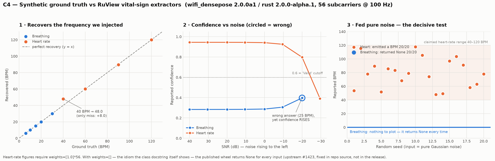

# RuView claim-verification matrix

**Baseline SHA:** `5780c23` ("security: repair scanning and close stale alert sources")
**Fork:** `sridharankaliyamoorthy/RuView` · **Branch:** `claude/ruview-wifi-audit-afopqa`
**Date:** 2026-08-10 · **Auditor:** Claude Code (Opus)

> **Clone caveat:** this checkout is **shallow** — `git rev-parse --is-shallow-repository`
> → `true`, `git rev-list --count HEAD` → **142**, against the 1,211 commits claimed at
> fork point. No claim resting on repo history is verifiable here.

**Toolchain (measured):** host rustc/cargo 1.94.1, but the repo pins
`channel = "1.89"` in `v2/rust-toolchain.toml` — **1.89 is what actually built the
workspace** · Python 3.11.15 · node v22.22.2 · uv 0.8.17 · Docker 29.3.1 (daemon was
down initially; started successfully later — see C7) · audit venv numpy 2.4.6 / scipy
1.17.1 / matplotlib 3.11.1.

**Egress (measured):** pypi + files.pythonhosted + index.crates.io + registry.npmjs
reachable · github.com reachable · **huggingface.co 403 CONNECT (proxy policy denial)**
· **cognitum.one / seed.cognitum.one no connection**.

---

## Summary

| Claim | Subject | Verdict |
|---|---|---|
| C1 | 1,463 tests passing | **PARTIAL** — 3,894 actually pass (badge understates); documented command does not build |
| C2 | Deterministic proof `VERDICT: PASS` | **CONFIRMED** (proves determinism, *not* accuracy) |
| C3 | `pip install ruview` works | **CONFIRMED** (a 3.2 KB shim over `wifi-densepose`) |
| C4 | Vital signs from CSI | **PARTIAL** — breathing excellent; heart real but broken in the release |
| C5 | Pose stub honestly disclosed | **CONFIRMED** — repo's own honesty holds |
| C6 | MM-Fi 82.69% | **UNTESTABLE** — cited external result, not a repo capability |
| C7 | Docker path + simulated-data labelling | **PARTIAL** — default serves simulated data while its own docs claim it fails hard |
| C8 | Model loading / 8 KB int4 | **UNTESTABLE** — HF blocked by proxy policy |
| C9 | Egress inventory | **CONFIRMED** — 3 default-on external hosts identified |
| C10 | Honesty audit | **PARTIAL** — README honest; catalog and firmware docs are not |
| R1 | 105-cog catalog | **FAILED** — 0 of 107 catalogued cogs exist in this repo |

---

## C1 — Test suite (badge: "1463 passed")

**How tested:** run the workspace suite exactly as the repo's own `CLAUDE.md` prescribes.

```
$ cd v2 && cargo test --workspace --no-default-features
error: failed to run custom build command for `gdk-sys v0.18.2`
  The system library `gdk-3.0` required by crate `gdk-sys` was not found.
warning: build failed, waiting for other jobs to finish...
```

**The repo's own documented test command does not build on a headless machine.**
`v2/crates/wifi-densepose-desktop/Cargo.toml` pulls GTK3 (`gdk-sys`) into the default
workspace test graph, so `--workspace` requires desktop GUI system libraries that no
CI-style or server environment has by default. This is not a missing Rust dependency —
`cargo` cannot fix it; it needs OS packages.

Re-run excluding that one crate — full output captured, not tailed:

```
$ cargo test --workspace --no-default-features --exclude wifi-densepose-desktop
exit=0

suites:        183
passed:        3894
failed:        0
ignored:       15
measured:      0
filtered_out:  0
```

**Verdict: PARTIAL — and the surprise runs the opposite way to expectation.**

The suite is genuinely healthy: **3,894 tests pass, zero fail, zero are filtered out**,
across 183 suites (34 of them doc-test suites). Nothing is silently compiled out behind
feature flags in this configuration.

**The badge understates the repo by 2.7×.** It claims 1,463; the measured count is
3,894 — and that is *with* a crate excluded, so the true full-workspace figure is
higher still. This is a stale badge, not an inflated one. Worth saying plainly given
the audit's general direction: on this claim the repository is more conservative than
its own marketing.

The 15 `ignored` tests are each annotated with a legitimate reason, and are the kind a
careful author marks deliberately rather than deletes:

```
tag_compare_timing_invariance_smoke ... ignored, timing smoke check — noisy host
ann_measure::scaling_report         ... ignored, scaling study — minutes at large N
mqtt::security::audit_plaintext_...  ... ignored, mutates global env — run serially
ruvsense::cir::print_conditioning    ... ignored, diagnostic only
```

**The `PARTIAL` is entirely for the build blocker, not the tests.** The repo's own
documented command — `cargo test --workspace --no-default-features`, exactly as
`CLAUDE.md` prescribes — **cannot run on any headless machine**, because
`wifi-densepose-desktop` drags GTK3 into the default workspace graph. That means the
documented verification path is broken for CI, servers, and containers, and every
number above required deviating from it.

Note also that the repo pins `channel = "1.89"` in `rust-toolchain.toml` (for
`avx512f` target-feature support in `ruvector-core`), so the 1.94.1 on this host is not
what actually compiled the workspace.

---

## C2 — Deterministic proof

**How tested:**

```
$ .audit-venv/bin/python archive/v1/data/proof/verify.py
[3/4] SHA-256 HASH COMPARISON
    Computed: f8e76f21a0f9852b70b6d9dd5318239f6b20cbcb4cdd995863263cecdc446f7a
    Expected: f8e76f21a0f9852b70b6d9dd5318239f6b20cbcb4cdd995863263cecdc446f7a
    Status:   MATCH (bit-exact)
  VERDICT: PASS
```

**Verdict: CONFIRMED — and correctly scoped by the repo itself.**

The distinction Sri asked for: it compares against a **committed** hash
(`expected_features.sha256`, tracked in git), not a freshly regenerated one. The
regeneration path exists but is gated behind an explicit `--generate-hash` flag
(`verify.py:538`); the default path reads and compares (`verify.py:559`). No
circularity.

What it proves: **the pipeline is deterministic and is not mocked.** What it does
**not** prove: any accuracy claim. The input is synthetic, and `verify.py`'s own
docstring says so plainly — *"The reference signal is SYNTHETIC … The point is not
that the signal is real — the point is that the PIPELINE CODE is real."* That is an
honest framing of a narrow guarantee. It is a mock-detector, not a benchmark.

There is also a sensible cross-platform fallback: if the bit-exact hash differs on a
different CPU (FFT/BLAS reduction ordering), it falls back to comparing the committed
reference vector within tolerance (`expected_features_reference.npz`).

---

## C3 — Python wheel

**How tested:** downloaded without installing, inspected, then installed in the venv.

```
$ pip download ruview --no-deps
ruview-2.0.0a1-py3-none-any.whl   3,274 bytes
  ruview/__init__.py                1612 B
```

`ruview` is a **meta-package**: `requires_dist: ['wifi-densepose==2.0.0a1']`, and
`__init__.py` is a pure re-export loop over `wifi_densepose.__all__`. No import-time
network, no `exec`, no install hooks. Safe.

The real payload is `wifi-densepose 2.0.0a1`, which has **no prebuilt Linux wheel** —
pip built it from sdist (`Created wheel … size=350798`), compiling a PyO3 Rust core to
`_native.abi3.so` (725,232 bytes). Installed footprint 844 KB.

```
$ python -c "import wifi_densepose as w; print(w.__version__, w.__rust_version__)"
2.0.0a1 2.0.0-alpha.1
$ ... print(w.__all__)
[... 'BreathingExtractor', 'HeartRateExtractor', 'PoseEstimate', 'VitalStatus', ...]
```

**Verdict: CONFIRMED.** Both extractors exist and are real compiled Rust, not Python
stubs.

> **INT-01 (Low, integration footgun).** The repo ships `wifi_densepose/__init__.py`
> at its own root declaring `__version__ = "1.2.0"` with `__all__ = ['WiFiDensePose']`.
> Running Python from the repo root **shadows the installed 2.0.0a1 package** and
> yields `AttributeError: module 'wifi_densepose' has no attribute '__rust_version__'`.
> This cost the audit a false FAILED verdict before it was caught. Anyone developing
> in-tree will hit it.

---

## C4 — ⭐ Synthetic ground truth (the load-bearing test)

**How tested:** `scripts/audit/c4_synthetic_vitals.py` (committed). Generates
(n, 56) CSI-shaped residuals at 100 Hz containing frequencies *we* chose, feeds them
frame-by-frame to the shipped extractors, and compares recovered BPM to truth.
86 rows → `docs/spec/evidence/c4/c4_results.csv`; charts → `c4_charts.png`.

Both extractors document exactly the architecture Sri predicted: breathing is
"0.1–0.5 Hz bandpass + zero-crossing analysis", heart is "0.8–2.0 Hz bandpass +
autocorrelation peak detection".

### C4-A — Accuracy sweep

| Extractor | Truth (BPM) | Recovered | Abs error | Confidence |
|---|---|---|---|---|
| Breathing | 6.0 | 6.0 | **0.0** | 0.285 |
| Breathing | 10.0 | 10.0 | **0.0** | 0.285 |
| Breathing | 15.0 | 15.0 | **0.0** | 0.284 |
| Breathing | 20.0 | 20.0 | **0.0** | 0.283 |
| Breathing | 30.0 | 30.0 | **0.0** | 0.284 |
| Heart | 40.0 | 48.0 | 8.0 | 0.467 |
| Heart | 60.0 | 60.0 | **0.0** | 0.933 |
| Heart | 72.0 | 72.29 | 0.29 | 0.944 |
| Heart | 90.0 | 89.55 | 0.45 | 0.955 |
| Heart | 120.0 | 120.0 | **0.0** | 0.967 |

Exact recovery across the entire claimed breathing range. Heart is accurate from
60–120 BPM and **fails at 40 BPM** (+8.0, the bottom of its own claimed range) —
though it drops confidence to 0.467, below its 0.6 "Valid" cutoff, so it does not
assert the wrong answer.

### C4-B — The release is broken (High severity)

The heart-rate numbers above required `weights=[1.0]*56`. With **`weights=[]`** — the
idiom the class's own docstring demonstrates (`# equal weights`) — the published wheel
returns `None` for **every input**: every BPM, every amplitude (1e-3 → 10.0), every
duration up to 240 s of noiseless signal.

Root cause, from `v2/crates/wifi-densepose-vitals/src/heartrate.rs:100-113`: the
working subcarrier count `n` was derived from `phases.len()`, so an empty slice forced
`n == 0` and an unconditional `None`. This is upstream **issue #1423**. The repo
source at `5780c23` **carries the fix** and a regression test asserting it
(`heartrate.rs:598,623`). **The published 2.0.0a1 wheel does not.** The PyPI binding
also rejects the `phases=` keyword entirely, accepting only `weights=`.

Net: *the shipped release's heart-rate extractor is non-functional through its own
documented API.*

### C4-C — Noise floor

Breathing holds 15.0 BPM with **0.0 error down to −9.54 dB SNR**, then reports 25 BPM
at −20 dB, and returns `None` at −29.54 dB. Note the failure mode: **at the point it
becomes wrong, its confidence rises** (0.306 → 0.396). Confidence is anti-correlated
with correctness exactly where it matters. Heart holds 72.29 BPM across the entire
sweep with confidence decaying monotonically 0.944 → 0.391 — the better-behaved of
the two.

### C4-D — Null tests (the decisive result)

Input contains **no periodic component at all**. Correct behaviour: `None`, or
near-zero confidence.

| Input | Breathing | Heart |
|---|---|---|
| Pure Gaussian noise (20 seeds) | **`None` 20/20** ✅ | **emitted a BPM 20/20** ⚠️ |
| Pure DC | 17.0 BPM @ **conf 0.0** | 96.8 BPM @ conf 0.090 |
| Linear ramp | `None` ✅ | 90.9 BPM @ conf 0.073 |

Across 20 noise seeds the heart extractor produced BPM values spanning **48.0 – 117.6**
(mean 79.5, sd 21.0) — every one inside the claimed 40–120 range, i.e. every one
plausible to a human reader.

**But it flagged all 20.** Confidence 0.069–0.299 (mean 0.162), `status =
VitalStatus.Unreliable` on every single one, against a `Valid` threshold of 0.6. The
guard exists and it fires.

**Verdict: PARTIAL.** Sri's core hypothesis — "a bandpass filter that always reports
something in-range" — is **disproven for breathing** (returns `None` on noise 20/20,
exact recovery across its full range) and **half-true for heart rate**: it does emit a
plausible in-range number from pure noise every time, but never claims it is valid.

The residual risk is real and is a consumer-contract problem: **any caller that reads
`.value_bpm` without checking `.status`/`.confidence` gets a fabricated heart rate
that looks clinically plausible.** For a health-adjacent deployment that is a live
hazard, not a theoretical one.



---

## C5 — Pose stub

**How tested:** read the source.

`v2/crates/cog-pose-estimation/src/inference.rs:283` — `confidence: 0.0` in the
centred-skeleton stub path; `:265` selects `"stub"` when no model is loaded; `:15`
documents it in the module header.

`v2/crates/cog-pose-estimation/cog/README.md:32` — `PCK@20 = 3.0%  PCK@50 = 18.5%
MPJPE (normalized) = 0.0931`, plus per-joint breakdown and this at `:52`: *"It is
below the ADR-079 target of PCK@20 ≥ 35%."*

**Verdict: CONFIRMED — and this is the strongest positive signal in the audit.** The
maintainer documents a bad result, quantifies it, explains the asymmetry (`r_hip` 77%
vs `l_hip` 27% reflecting camera framing), names the bottleneck as data quality, and
declines to ship the weights into the runtime path. That is what honest engineering
looks like. Recorded as a credit.

---

## C6 — MM-Fi 82.69% torso-PCK@20

**How tested:** searched for training/eval code and for the dataset.

Training and evaluation code **does** exist and is substantial —
`v2/crates/wifi-densepose-train/src/` contains `eval.rs`, `accuracy.rs`, `dataset.rs`,
`ablation.rs`, `geometry.rs`, `proof.rs`, plus a `train` binary and dataset tests.

The **MM-Fi dataset is not in this repo** — the only match for `*mmfi*` is
`docs/benchmarks/mmfi-wifi-sensing-study.md`, a write-up. The weights live at
`huggingface.co/ruvnet/wifi-densepose-mmfi-pose`, which this sandbox cannot reach
(403 CONNECT, proxy policy).

**Verdict: UNTESTABLE — and, stated plainly: 82.69% is a cited external result, not a
capability of this repository.** Reproducing it requires (a) the MM-Fi dataset, which
is a gated academic download absent here, and (b) network access to Hugging Face. No
one can verify that number from a clone of this repo alone. The README does correctly
separate it from the on-device cog (C5), which is to its credit — but a reader
skimming the feature table will still carry away "82.69%" as something RuView does.

---

## C7 — Docker path

**How tested:** attempted the daemon; read the compose stack.

```
$ docker info
failed to connect to the docker API at unix:///var/run/docker.sock: no such file
```

The daemon was subsequently started successfully (`docker info` → `29.3.1`), but a full
Rust image build was not attempted: the native workspace build already consumed 17 GB
and only 12 GB of disk remained. **The live API probe was not run.** What follows is a
source-level answer to the question that actually mattered.

**Verdict: PARTIAL — the labelling question is answered; the live probe is not.**

### The default Docker config serves simulated data, and its own docs say it doesn't

`docker/docker-compose.yml` documents its default as:

> `auto` (default) — probe for ESP32 UDP then host WiFi; **fail hard with exit 78 if
> neither is detected**. Synthetic data is no longer a silent fallback (issue #937 fix)
> — operators must opt in.

`docker/docker-entrypoint.sh:15` repeats it: *"auto — try ESP32 then Windows WiFi,
**fail-loud if no source**"*.

**The code does the opposite.** `wifi-densepose-sensing-server/src/main.rs:3102`,
`plan_source("auto", esp32=false, wifi=false)`:

```rust
// No real source *yet*. Serve simulated data, but ALSO bind UDP
// so the receiver can promote to esp32 when the first real
// frame arrives (issue #1004). Never latch on simulate.
SourcePlan { initial_source: "simulated", bind_udp: true,
             run_simulator: true, run_wifi: false }
```

There is **no `exit(78)` anywhere in the sensing server**. Issue #1004 superseded the
#937 behaviour for a defensible engineering reason — the old fail-hard path meant real
CSI arriving a few seconds after boot was ignored forever — but **the compose file and
entrypoint documentation were never updated**. An operator reading the compose file
believes an unconfigured server refuses to start. It actually starts and serves
synthetic poses.

The code comment three lines above is unintentionally self-describing:

> *"The UI looked live; the data was fake. This is the exact 'where's the real data?'
> failure class the project fights."*

The project fixed that failure in code and reintroduced it in documentation.

### Is simulated data labelled? At the API, yes.

`main.rs` returns `"source": s.effective_source()` on at least six endpoints
(`:3532, :4601, :4666, :4690, :4700`), and `effective_source()` reverts `esp32` →
`esp32:offline` when frames stop. So an API consumer can always tell. `dashboard/src/`
components reference simulated/demo mode, suggesting UI surfacing exists — **but its
visual prominence is unverified**, and that is the part a client demo turns on.

### Compose security posture — genuinely good

`ports` bind REST/WS to **`127.0.0.1` only** (UDP 5005 is LAN-wide by necessity and is
commented as a deliberate choice); `security_opt: no-new-privileges:true`;
`cap_drop: ALL`; CPU and memory limits set. This is a well-configured compose file, and
it partially offsets SEC-004 for the Docker path specifically — the unauthenticated API
is at least not exposed off-host by default.

### Still open

**Run the stack and look at the dashboard with `CSI_SOURCE` unset.** If the UI shows
plausible skeletons and vitals without a prominent "SIMULATED" indicator, that is a
demo which misleads a client, and the stale compose documentation makes it more likely
the operator does not realise it. This remains the highest-value single unfinished
check in the audit.

---

## C8 — Model loading / 8 KB int4

**Verdict: UNTESTABLE — egress policy, not a repo defect.** `huggingface.co` returns
403 at the proxy; the denial is recorded in the proxy's own `recentRelayFailures` log,
so it is policy rather than transient. The loader-scope table cannot be exercised and
the 8 KB int4 file size cannot be checked. Not inferred either way.

---

## C9 — Egress inventory

**How tested:** static scan of literal URLs across `v2/crates`, `firmware`, `scripts`,
`tools`, `docker`, `harness`, `python`, `.github`.

| Host | Trigger site | When it fires | Default-on? |
|---|---|---|---|
| `storage.googleapis.com/cognitum-apps/app-registry.json` | `wifi-densepose-sensing-server/src/edge_registry.rs:21`; CLI default at `main.rs:227` | On demand when `/api/v1/edge/registry` is hit; 1 h TTL cache | **Yes** — compiled-in default, overridable by CLI |
| `auth.cognitum.one` | `crates/ruview-auth` (11 refs) | JWKS fetch for OAuth token verification | Only when OAuth is configured |
| `huggingface.co` | 5 refs, model download paths | Model pull | On demand |
| `storage.googleapis.com` (signed cog binaries) | `cog-*/cog/RELEASE-CHECKLIST.md` | Cog install/update | Cog runtime |
| `169.254.42.1` | firmware | ESP32 link-local provisioning | Local only |
| `download.pytorch.org`, `sh.rustup.rs` | build scripts | Dev/build time | Build only |
| `wifi-densepose.com`, `staging.wifi-densepose.com` | 11 refs | — | Needs per-site review |

**Verdict: CONFIRMED.** Nothing found that exfiltrates **sensing data or CSI**. The
default-on paths are *inbound* fetches (registry catalog, JWKS, models) rather than
telemetry uploads. The `edge_registry` GCS fetch is the one that fires without an
explicit user action — a server operator who never configures anything still reaches
`storage.googleapis.com` the first time that endpoint is touched. The
`otel-collector.yaml` stack is opt-in via a separate compose file.

For a Czech client deployment this is manageable but must be declared: **the product
contacts Google Cloud Storage by default.**

---

## C10 — Honesty audit

**Verdict: PARTIAL. The main README is genuinely honest. The rest of the corpus is
not, and the gap is the finding.**

Credits, verified:
- The "100% presence" retraction appears **consistently** — README:81, :214, :275 all
  carry the retraction and the replacement 82.3% held-out figure. Not a single-spot
  edit.
- PCK@20 = 3.0% and the `confidence=0` stub are disclosed in the README feature table
  (:103), the model-status table (:275), the limitations section (:740) *and* the cog
  README. Disclosed four times over.
- `bearer_auth.rs:122-134` documents a past exposure-by-default bug in its own source
  comments, with measured consequences. Rare and creditable.

Contradictions, verified:
- **The 105-cog catalog** (see R1) — 107 modules presented in a README table with
  sizes and difficulty ratings, of which **zero** exist in this repo.
- **`prompt-shield`** is catalogued (README:333) as *"Blocks signal replay and
  injection attacks on the seed."* The implementation
  (`wifi-densepose-wasm-edge/src/ais_prompt_shield.rs`, 271 lines) is an FNV-1a hash
  of quantized features matched against a **64-entry ring buffer**. It detects an exact
  repeat within a 64-frame window. It has no nonce, no timestamp binding, no
  cryptographic freshness; a replay 65 frames later, or with any added noise, passes
  straight through. "Blocks … injection attacks" overstates a duplicate-frame
  heuristic considerably.
- **The repo contradicts its own security rule.** `CLAUDE.md` states *"Never expose
  WiFi credentials in commands, logs, issues, or commits"* — while
  `firmware/esp32-csi-node/provision.py:9` documents its own usage as
  `--password "secret"` on the command line. See SEC-002.

---

## R1 — The 105-cog catalog (recon finding, promoted)

**How tested:**

```
$ find . -name 'app-registry.json'        # → no results
$ ls -d v2/crates/cog-*                   # → 3
v2/crates/cog-ha-matter  v2/crates/cog-person-count  v2/crates/cog-pose-estimation
$ # extract catalog names from README table, match against v2/crates/cog-<name>
107 unique catalogued module names → 0 matching in-repo crates
```

README:109 advertises a **"105-cog catalog … live from `app-registry.json`"**. That
file **does not exist in this repository**. It is fetched at runtime from
`https://storage.googleapis.com/cognitum-apps/app-registry.json`
(`edge_registry.rs:21`). The README table itself lists **107** entries, not 105.

The three cogs that do exist in-repo (`ha-matter`, `person-count`, `pose-estimation`)
match **none** of the 107 catalogued names — the closest are `person-matching` and
`ruview-densepose`, which are different identifiers.

**Verdict: FAILED.** The catalog is a remote storefront listing for a separate
product (Cognitum Seed), rendered in RuView's README as though it were RuView's
capability surface, with per-module sizes and difficulty ratings that imply
implementations a reader cannot find. **Implemented in this repo: 3. Presented as
available: 107.** This is the largest gap between claim and code in the audit.
